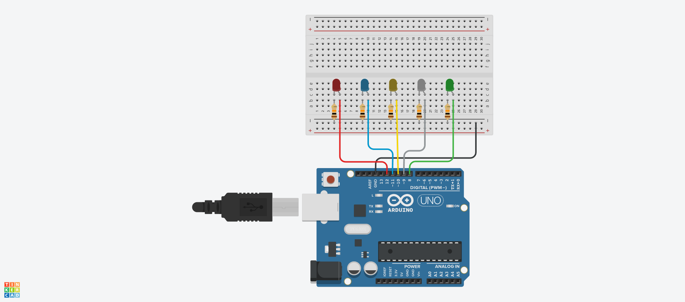

# Laboratory Activity #1: Working with Digital Signals

---

## COSC 111B - CS Elective 3: Internet of Things  
**1st Semester, 4th Year BSCS 4B**  
**Instructor:** Sir Johnroe Paulo Cañamaque  

---

🔗 **TinkerCad Circuit:** [View the circuit here](https://www.tinkercad.com/things/2IPpCmf2Kyc-activity-1/editel?returnTo=https%3A%2F%2Fwww.tinkercad.com%2Fdashboard%2Fdesigns%2Fcircuits&sharecode=L094NlnBJXxVfPSNS5jQyn7XZ5Dq56siixmCJ0mjZ8Q&fbclid=IwY2xjawM2M1JleHRuA2FlbQIxMABicmlkETFIb2dqY3lzWm9qT3UwcGNJAR75EWZ7Y8ZMAZ-9GRJ-nk3iVeL9n7euc6onSvdppo9Nt8nZZD36FpbIGO0J-w_aem_o-7kLAlYVED3o6TFtikYOw)  

---

## 📌 Group Information
**Leader:**  
- Mayor, Mark Aaron A.  

**Members (Alphabetical Order by Surname):**  
- De Silva, Krisha — 98  
- Malinis, Johnbert — 95  
- Monzon, Denys — 93 
- Pula, Henry Luis — 96

---

## 📌 Generative AI Citation
- **Tool Used:** ChatGPT  
- **Model:** GPT-5  
- **Prompt:** *"c++ loop srudino"*  
- **Conversation Link:** [ChatGPT Reference](https://chatgpt.com/share/68c9530e-c970-8011-bf50-900db559b68d)
- **Prompt:** *"lets make readme.md that put this link"*  
- **Conversation Link:** [ChatGPT Reference](https://chatgpt.com/share/68c95a65-9b00-8011-b1db-504355f0e934)

---
